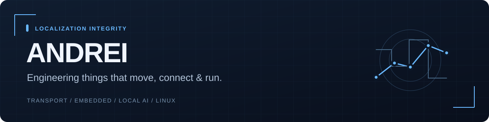

### Engineering student. Hands-on builder.

I'm **Andrei**, a third-year engineering student at **POLITEHNICA Bucharest**, studying electronics and telecommunications in transport. I build software around the systems I work with: vehicle data, navigation, Linux infrastructure and local AI.

My projects connect practical problems to inspectable engineering: explicit contracts, repeatable demos, tested failure paths and documented limits.

**Explore:** [Transport security](projects/miragetransit.md) · [Navigation integrity](projects/trustnav.md) · [Embedded CAN](projects/obican.md) · [Local automotive AI](projects/cardock.md) · [Homelab](projects/sentilab.md)

## Selected builds

| Project | What I built | Current delivery |
| --- | --- | --- |
| **[MirageTransit](https://github.com/andreicup/MirageTransit)** | Deterministic fleet simulation, durable command journal and verified replay for transport security research | **Core + replay delivered** · 0.1.0.dev2 · public source |
| **[TrustNav](projects/trustnav.md)** | GNSS integrity checks, motion fusion, explicit uncertainty and frozen evaluation workflows | **Software candidate** · 1.0.0rc2 · private source |
| **[OBiCAN](projects/obican.md)** | Passive ESP32 Classical CAN recording, buffered microSD storage and offline log analysis | **Firmware built** · physical bench qualification next · private source |
| **[CarDock](projects/cardock.md)** | Local AI case workflow combining symptoms, OBD observations and explicitly mapped VCDS imports | **Software alpha** · 0.2 · real model/dock evaluation next · private source |
| **[Sentilab](projects/sentilab.md)** | Linux server telemetry, automatic service discovery, allowlisted controls and Ollama management | **Deployable software** · target-host validation next · private source |

Each project page explains the implemented behavior, verification and next acceptance gate. Private projects have public summaries here; their source repositories remain private. Status reflects the **5 October 2026** portfolio checkpoint.

## What these projects demonstrate

| Focus | Practical work |
| --- | --- |
| **Transport & embedded systems** | Classical CAN, ESP32/ESP-IDF, read-only OBD, vehicle observations and localization integrity |
| **Reliable software** | Deterministic replay, SQLite transactions, bounded queues, stale-data handling and explicit validity |
| **Self-hosted infrastructure** | Linux, Docker, systemd, Go host agents, service discovery and restricted administration |
| **Local AI & interfaces** | Ollama integration, validated structured output, evaluation workflows, React/TypeScript and responsive web UIs |

Beyond the repositories, I maintain a homelab, work with automotive diagnostics and have configured OpenWrt with 802.1X authentication. These are the practical problems that drive what I build.

---

**Current direction:** transport systems, embedded software and infrastructure engineering.
