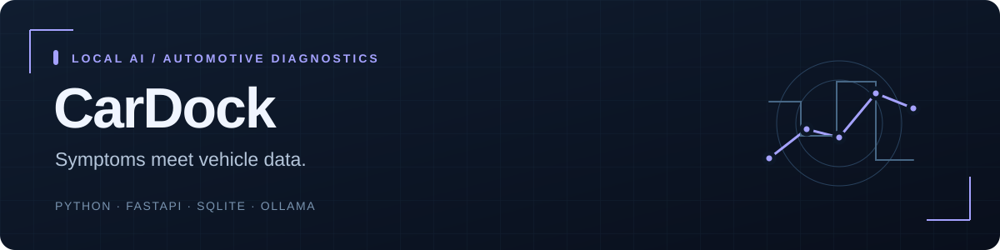

# CarDock

[← Back to profile](../README.md)

A local automotive companion that combines symptom narratives, explicit OBD/VCDS imports and structured local-model responses.

**Status:** Software alpha 0.2 · real model and dock evaluation pending.  
**Stack:** Python · FastAPI · SQLite · Ollama.  
**Source:** Private; this page is a public project summary.

## The engineering problem

A symptom description becomes more useful when it is tied to timestamped vehicle observations. The case workflow needs to distinguish stale or synthetic input and incomplete evidence before asking a local model to interpret it.

## Implemented

- Persistent case, conversation, critical-sign and resolution workflow with a Romanian responsive interface.
- Ollama structured responses, controlled source identifiers and explicit unavailable/error states.
- Canonical imports, DTC text and explicit VCDS mapping with temporal context.
- Paired read-only OBD agent, revocation, reconnect/offline queue and stale/synthetic labels.
- Evaluation tooling, export/print and backup/restore.

## Verification

58 pytest cases are recorded in the release report. CI passes evaluation contracts, the OBD simulator, Docker and desktop/mobile browser checks. The 48 synthetic scenarios validate contracts rather than real diagnostic accuracy.

These are software/synthetic-fixture checks documented in the private repository. They do not establish real-world accuracy, compatibility or hardware performance.

## What remains

Two real Ollama models, reviewed outputs, anonymized real VCDS logs, physical OBD behavior and confirmed repair cases.

Portfolio checkpoint: **5 October 2026**. The project is presented at its actual delivery stage, with later capabilities left as explicit next steps.
