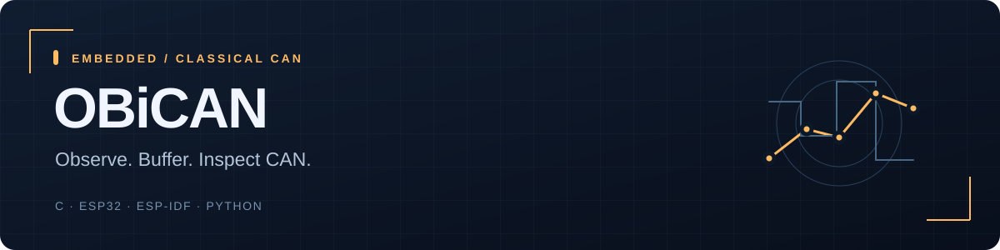

# OBiCAN

[← Back to profile](../README.md)

A passive Classical CAN logger with buffered microSD capture, loss counters and offline analysis tools.

**Status:** V1 firmware built · bench qualification pending.  
**Stack:** C · ESP32 · ESP-IDF · Python.  
**Source:** Private; this page is a public project summary.

## The engineering problem

CAN capture needs to stay observable when storage is slower than reception. A university prototype should show queue behavior and lost-frame accounting, while its hardware path remains deliberately receive-only.

## Implemented

- ESP32 firmware for 11-bit/29-bit Classical CAN frames and fixed selectable bitrates.
- Listen-only controller operation, receive-only wiring specification and separate bench transmitter.
- Buffered CSV sessions, file rotation, final counters and bounded queue loss accounting.
- Dependency-free Python simulation, validation, statistics and candump export.

## Verification

Both ESP32 firmware targets compile with native ESP-IDF 5.4.2 in CI. Host tests, sanitizer checks, a synthetic capture and listen-only source guard pass.

These are software/synthetic-fixture checks documented in the private repository. They do not establish real-world accuracy, compatibility or hardware performance.

## What remains

Electrical receive-only qualification, sustained bus rate, physical SD reliability and vehicle/gateway compatibility.

Portfolio checkpoint: **5 October 2026**. The project is presented at its actual delivery stage, with later capabilities left as explicit next steps.
