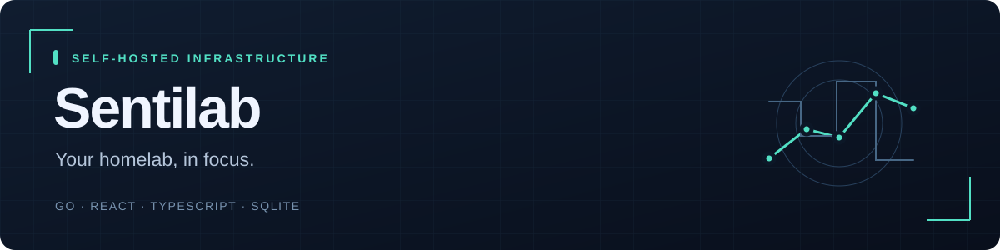

# Sentilab

[← Back to profile](../README.md)

A single-server Linux dashboard with real telemetry, automatic application discovery and allowlisted controls.

**Status:** Deployable software · host validation pending.  
**Stack:** Go · React · TypeScript · SQLite.  
**Source:** Private; this page is a public project summary.

## The engineering problem

A homelab needs a usable view of real server state without adding an external database or a heavy monitoring stack. The administrative interface must also preserve a narrow boundary between a web dashboard and privileged host operations.

## Implemented

- Go host agent and server, React/TypeScript dashboard and local SQLite persistence.
- Host metrics, physical filesystem telemetry, Docker/systemd discovery and a bundled application catalog.
- Allowlisted controls, first-run setup, authenticated sessions and configurable collectors.
- Local Ollama inventory/operations, hardware-aware model selection, explicit energy estimates and alert delivery integration.
- Separate authentication/SSH/fail2ban activity, physical disk browsing and confirmed stopped-container deletion.

## Verification

The latest verification record reports local race tests, vet, installer fixtures, frontend build and 41 synthetic browser checks. The latest source update also passed the full CI pipeline, including browser and image jobs.

These are software/synthetic-fixture checks documented in the private repository. They do not establish real-world accuracy, compatibility or hardware performance.

## What remains

Installation on the target Linux host, physical sensors/SMART permissions, actual service controls and Discord delivery.

Portfolio checkpoint: **5 October 2026**. The project is presented at its actual delivery stage, with later capabilities left as explicit next steps.
