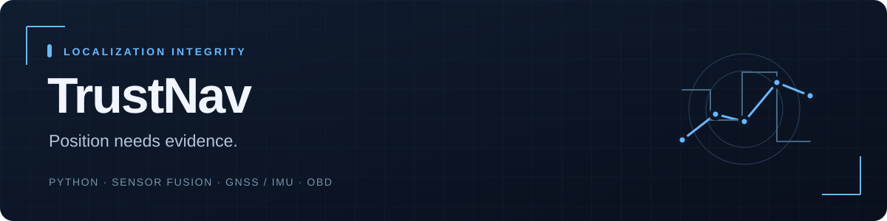

# TrustNav

[← Back to profile](../README.md)

A localization integrity engine that checks GNSS against independent motion and exposes position validity, uncertainty and source reasons.

**Status:** 1.0.0rc2 · software candidate; field evidence pending.  
**Stack:** Python · Sensor fusion · GNSS / IMU · OBD.  
**Source:** Private; this page is a public project summary.

## The engineering problem

A plausible GPS coordinate can still be wrong. Comparing GNSS with independent motion needs explicit validity and uncertainty, plus evaluation that exposes blind spots and avoids mixing fitting data with held-out evidence.

## Implemented

- Automotive motion fusion, GNSS consistency checks, recovery rules and explicit position validity.
- Offline graph association with ambiguity, along-track rail hypotheses and walking observability.
- Phone/OBD acquisition tools, authenticated live ingestion and stale-data expiry.
- Replay UI, SDK/contracts and dataset freeze, validation fit and held-out evaluation tools.

## Verification

The rc2 validation report records 72 tests passing across Python 3.11/3.12/3.13 in CI, plus freeze/fit/held-out workflows, packaging, authenticated container checks and desktop/mobile browser checks.

These are software/synthetic-fixture checks documented in the private repository. They do not establish real-world accuracy, compatibility or hardware performance.

## What remains

Real phone/OBD timing, mount calibration, independent-reference driving/walking/rail journeys and field coverage.

Portfolio checkpoint: **5 October 2026**. The project is presented at its actual delivery stage, with later capabilities left as explicit next steps.
